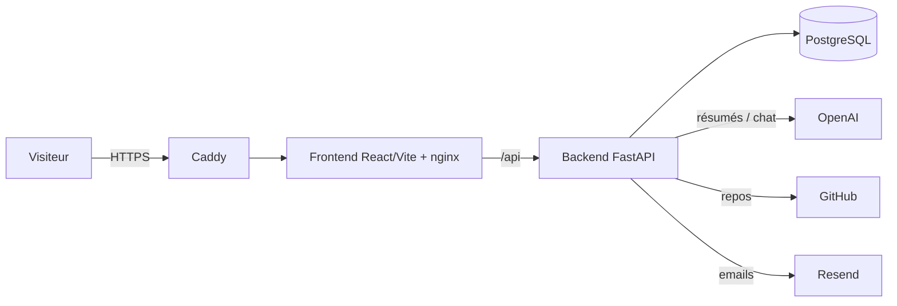

# AI Portfolio — portfolio bilingue propulsé par l'IA

> Portfolio full-stack pour profils **Data / IA** : auto-alimenté depuis GitHub,
> résumés de projets par LLM, **chatbot RAG** qui répond sur votre parcours (et lit
> votre CV en direct), **bilingue FR/EN**, **back-office d'administration**, le tout
> déployable en un `docker compose` derrière HTTPS.

**Démo en ligne → https://raoufaddeche.duckdns.org**


## ✨ Fonctionnalités

- 🤖 **Chatbot RAG bilingue** — répond aux visiteurs à partir de la base + du CV
  (lu en direct), avec mémoire de conversation. Anti-hallucination, rate-limité.
- 🔄 **Synchro GitHub** — résume et catégorise vos repos via LLM (à la demande / cron / Action).
- 🗂️ **Curation** — back-office `/admin` (token) : valider les projets, modérer les avis, lire les messages.
- 🌍 **Bilingue FR/EN** — contenu et UI, bascule instantanée.
- 📨 **Contact & avis** — formulaire + avis modérés, notifications email (Resend).
- 🎨 **Minimaliste, responsive, dark mode** — zéro emoji, une couleur d'accent.

## 🏗️ Architecture



3 conteneurs applicatifs (`db`, `backend`, `frontend`) + **Caddy** en frontal (HTTPS auto).
Migrations **Alembic**, gestion des dépendances Python avec **uv**.

## 🚀 Démarrage rapide (local)

```bash
cp .env.example .env          # renseigner DB / OpenAI / GitHub…
docker compose up -d --build  # migrations Alembic auto au boot
docker compose exec -T db psql -U "$POSTGRES_USER" -d "$POSTGRES_DB" < backend/sql/seed.sql
# → http://localhost:3000  (API : http://localhost:8000/docs)
```

Développement backend sans Docker : `cd backend && uv sync && uv run uvicorn app.main:app --reload`.

## ✏️ Le faire VÔTRE (c'est un template)

Tout votre contenu est de la **donnée / config**, pas du code :

| À éditer | Quoi |
|---|---|
| `frontend/src/config.js` | Nom affiché, fichiers CV, « faits clés » du hero |
| `backend/sql/seed.sql` | Profil, parcours, compétences, études de cas (FR + EN) |
| `frontend/public/` | Votre **photo** (`raouf.jpg`), votre **CV** (`cv-*.pdf`), favicon |
| `.env` | Secrets (DB, OpenAI, GitHub, Resend, `ADMIN_TOKEN`, `SYNC_TOKEN`), `DOMAIN`, `CV_URL` |
| `index.html` | `<title>` / meta SEO |

Les **projets** se remplissent seuls via `POST /api/github/sync` (puis validation dans `/admin`).
Le **chatbot** lit automatiquement le CV servi (`CV_URL`) — aucune fiche à maintenir à la main.

## 🌐 Déploiement (VPS + HTTPS)

Guide complet dans **[DEPLOY.md](DEPLOY.md)** (Caddy + Let's Encrypt + domaine, `docker-compose.prod.yml`).

## 📁 Structure

```
backend/    API FastAPI (app/ : routers, services github+llm+email+cv, alembic, sql)
frontend/   React + Vite + Tailwind (config.js, i18n, sections, /admin)
docker-compose.yml · docker-compose.prod.yml · Caddyfile · DEPLOY.md
```
